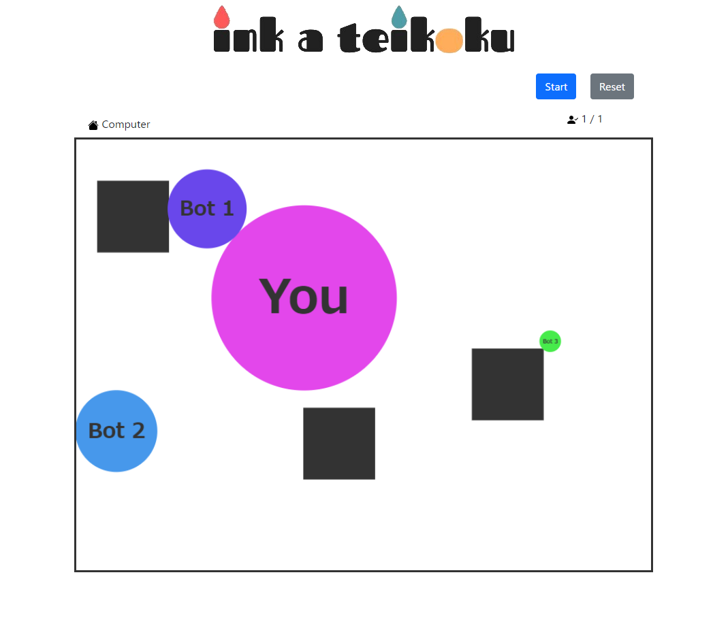

Ink a Teikoku is a simple and easy game where the winner is decided in one round, even with a large group of players. (Some times there is a tie.) Play once and you'll understand the whole game.

My team made this game for single player where players can play against computers. I then added online mode to the project personally.

In this project I gained experience with full-stack web application design and associated technologies, including the [Bootstrap](http://getbootstrap.com/) CSS Framework for the user interface, Javascript for both client and server-side programming, and [socket.io](https://socket.io/) for communication between a client and a server and making rooms for playing together.

Here is a sample image of game play:

Source: <a href="https://github.com/asterisk-cn/ink-a-teikoku"><i class="large github icon "></i>asterisk-cn/ink-a-teikoku</a>
